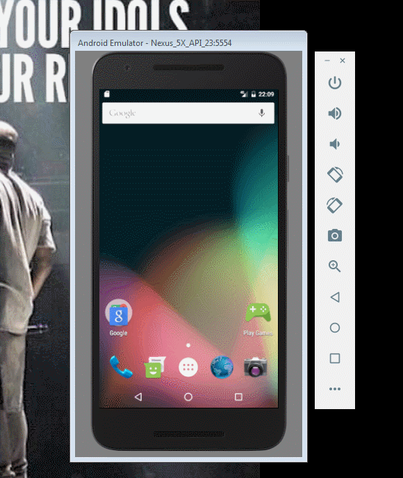

ToDoAppProject
========

An small entry demo app to join the http://www.CoderSchool.Vn learning activity. See the Tutorial on our cliffnotes for a step-by-step tutorial.

Time spent: [33] hours implementation in total:
- 09/23: 3 hours
- 09/24: 3 hours
- 09/25: 6 hours
- 09/26: 1 hour
- 09/27: 3 hours
- 09/28: 2 hours
- 09/29: 4 hours
- 09/30: 3 hours
- 10/01: 3 hours
- 10/02: 5 hours

Implement/App link: https://github.com/TienVNguyen/ToDoAppProject

========
### Submission Checklist:
* [x] Can you successfully add and remove items from the todo list within your app?
* [x] Did you include support for editing todo items as described above?
* [x] Does your app persist todo items and retrieve them properly on app restart?
* [x] Did you successfully push your code to github? Can you see the code on github?
* [x] Did you complete all required features? Did you try optional features (they will help you get in).
* [x] Did you add a README.md to the repo on github which includes a GIF walkthrough of the app's functionality?
* [x] Did you visit your application and submit using the pre-work form?

========
### Extending Your Todo
* [x] Persist the todo items into SQLite (http://guides.codepath.com/android/Persisting-Data-to-the-Device#sqlite) instead of a text file
* [x] Improve style of the todo items in the list using a custom adapter (http://guides.codepath.com/android/Using-an-ArrayAdapter-with-ListView)
* [x] Add support for completion due dates for todo items (and display within listview item)
* [] Use a DialogFragment (http://guides.codepath.com/android/Using-DialogFragment) instead of new Activity for editing items
* [x] Use a DialogFragment (http://guides.codepath.com/android/Using-DialogFragment) for filter option
* [x] Add support for selecting the priority of each todo item (and display in listview item)
* [x] Tweak the style improving the UI / UX, play with colors, images or backgrounds
* [x] Anything else that you can get done to improve the app functionality or user experience!

========
### Notes:
- Walkthrough of all functionalities:

